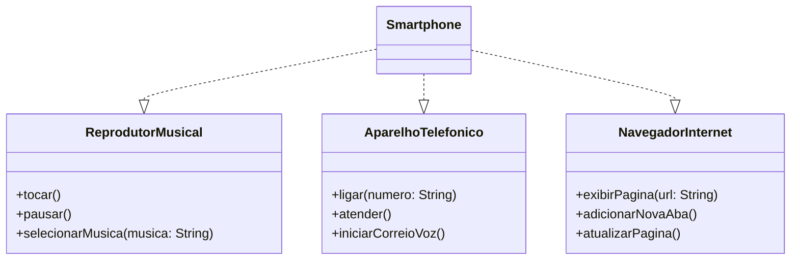

# Modelagem e Diagramação de um Componente iPhone

Neste desafio, você será responsável por modelar e diagramar a representação UML do componente iPhone, abrangendo suas funcionalidades como Reprodutor Musical, Aparelho Telefônico e Navegador na Internet.

## 📌 Objetivo

Demonstrar, de forma prática, a modelagem UML e sua implementação em Java, simulando as principais funcionalidades de um smartphone moderno.

---

## 📊 Diagrama UML


---
# 🧩 Interfaces
## 🎵 Reprodutor Musical
```Java
public interface ReprodutorMusical {
    void tocar();
    void pausar();
    void selecionarMusica(String musica);
}
```
## 📞 Aparelho Telefônico
```Java
public interface AparelhoTelefonico {
    void ligar(String numero);
    void atender();
    void iniciarCorreioVoz();
}
```
## 🌐 Navegador na Internet
```Java
public interface NavegadorInternet {
    void exibirPagina(String url);
    void adicionarNovaAba();
    void atualizarPagina();
}
```
---
## 📱 Classe Smartphone (Implementação)
```Java
public class Smartphone implements ReprodutorMusical, AparelhoTelefonico, NavegadorInternet {

    // Reprodutor Musical
    @Override
    public void tocar() {
        System.out.println("Tocando música...");
    }

    @Override
    public void pausar() {
        System.out.println("Música pausada.");
    }

    @Override
    public void selecionarMusica(String musica) {
        System.out.println("Selecionando música: " + musica);
    }

    // Aparelho Telefônico
    @Override
    public void ligar(String numero) {
        System.out.println("Ligando para: " + numero);
    }

    @Override
    public void atender() {
        System.out.println("Atendendo chamada...");
    }

    @Override
    public void iniciarCorreioVoz() {
        System.out.println("Iniciando correio de voz...");
    }

    // Navegador Internet
    @Override
    public void exibirPagina(String url) {
        System.out.println("Exibindo página: " + url);
    }

    @Override
    public void adicionarNovaAba() {
        System.out.println("Nova aba aberta.");
    }

    @Override
    public void atualizarPagina() {
        System.out.println("Página atualizada.");
    }
}
```
---
## 🚀 Classe de Teste
```Java
public class Main {
    public static void main(String[] args) {

        Smartphone smartphone = new Smartphone();

        // Reprodutor Musical
        smartphone.selecionarMusica("Imagine - John Lennon");
        smartphone.tocar();
        smartphone.pausar();

        // Telefone
        smartphone.ligar("1199999-9999");
        smartphone.atender();
        smartphone.iniciarCorreioVoz();

        // Navegador
        smartphone.exibirPagina("https://www.google.com");
        smartphone.adicionarNovaAba();
        smartphone.atualizarPagina();
    }
}
```
---
## 🧠 Conceitos Aplicados

- Programação Orientada a Objetos (POO)

- Uso de Interfaces (contratos)

- Polimorfismo

- Baixo acoplamento
---
